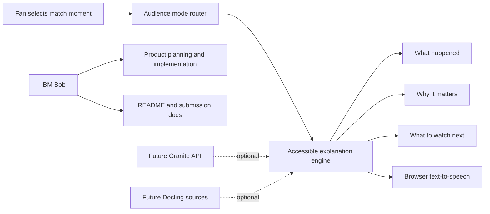
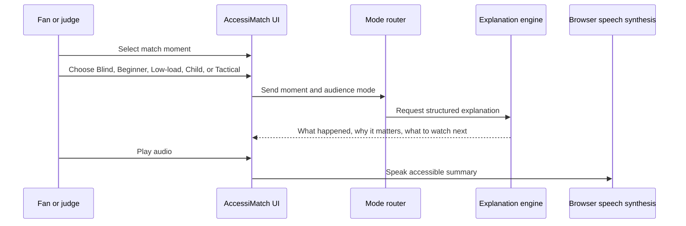

# AccessiMatch AI

AccessiMatch AI converts World Cup match moments into accessible explanations for blind, low-vision, neurodivergent, first-time, child-friendly, and tactical audiences.

The project is designed for the IBM SkillsBuild AI Student Innovation Challenge. It focuses on human-centered, explainable AI instead of predictions, trivia, fantasy, or generic tactical dashboards.

## Problem

Billions of people watch the same World Cup moments, but not everyone can understand them equally. A blind fan may need spatial audio description. A first-time fan may need simple soccer language. A neurodivergent fan may need shorter, lower-load explanations. A child may need a safe, friendly version.

AccessiMatch AI makes the same match moment understandable for different humans.

## Solution

The prototype lets a user:

- select a match moment from an event timeline
- choose an accessibility mode
- generate a structured explanation
- hear the explanation through browser text-to-speech
- adjust reading level, text size, contrast, motion, captions, and sources

Each generated explanation answers:

- what happened
- why it matters
- what to watch next

## IBM Technology Fit

- **IBM Bob**: used as the IBM-supported AI development assistant for product planning, UI structure, accessibility-mode design, implementation support, README preparation, and submission documentation.
- **IBM Granite-ready architecture**: the app is structured so mode-specific explanations can be replaced by Granite generation through watsonx.ai when an active runtime is available.
- **Docling-ready source pipeline**: FIFA documents, accessibility guidance, and match reports can be processed into source snippets for cited explanations.
- **LangChain / LangFlow-ready routing**: the selected match moment and audience mode can be routed to the right explanation prompt and source context.

Current prototype status: the app runs fully in demo mode without paid APIs. IBM Bob usage is documented in [docs/ibm-bob-usage.md](docs/ibm-bob-usage.md), the full Mermaid architecture pack is in [docs/architecture.md](docs/architecture.md), and the Bob session-style development log is in [bob_sessions/bob_task_july-01-2026_accessimatch-ai.md](bob_sessions/bob_task_july-01-2026_accessimatch-ai.md).

## Architecture





## Demo Flow

1. Open the app.
2. Select the **Momentum swing** moment at 61'.
3. Choose **Blind audio**, **Beginner**, **Low cognitive load**, **Child-friendly**, or **Tactical**.
4. Click **Generate explanation**.
5. Use **Play audio** to hear the explanation.
6. Adjust reading level, large text, contrast, and caption controls.

## Why It Can Win

- Strong challenge fit: human-centered, explainable, accessible, global scale.
- Less crowded than VAR explainers, predictors, tactical dashboards, and match companions.
- Easy for judges to understand in a 3-minute demo.
- Practical and emotionally clear: the same match becomes understandable for more fans.

## Run

```bash
npm install
npm run dev
```

Build check:

```bash
npm run build
```

## Environment

The current prototype runs with local demo data. For optional live Granite integration through watsonx.ai, add:

```env
VITE_IBM_API_KEY=
VITE_IBM_PROJECT_ID=
VITE_IBM_REGION=us-south
VITE_IBM_GRANITE_MODEL_ID=ibm/granite-3-8b-instruct
```

## API / Tool Links

- IBM Bob: https://www.ibm.com/products/bob
- IBM watsonx.ai API: https://cloud.ibm.com/apidocs/watsonx-ai
- IBM Granite community: https://github.com/ibm-granite-community
- Docling docs: https://docling-project.github.io/docling/
- LangFlow docs: https://docs.langflow.org/
- LangChain JS docs: https://js.langchain.com/docs/
