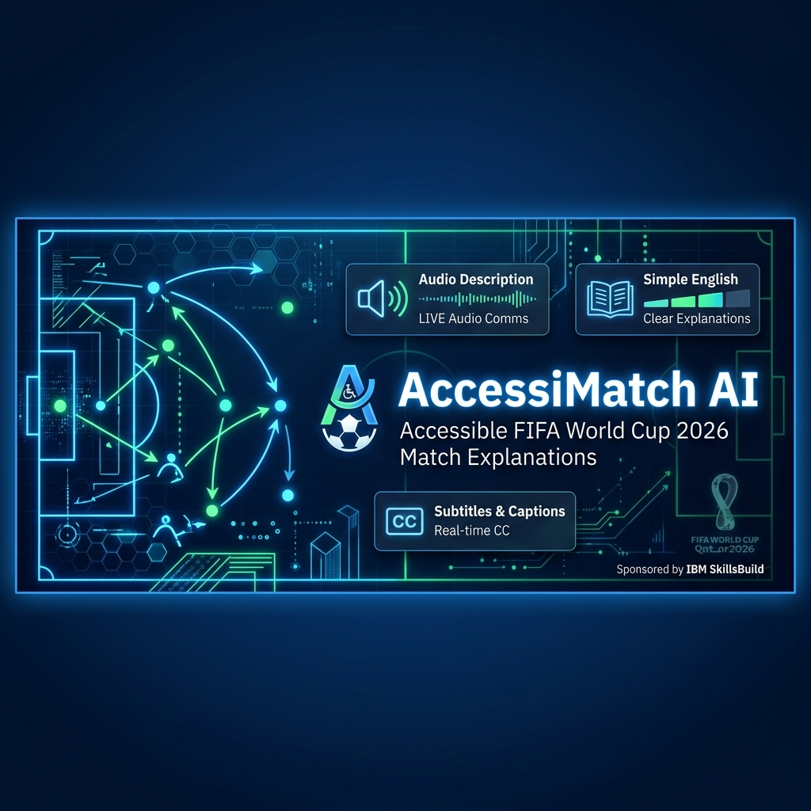
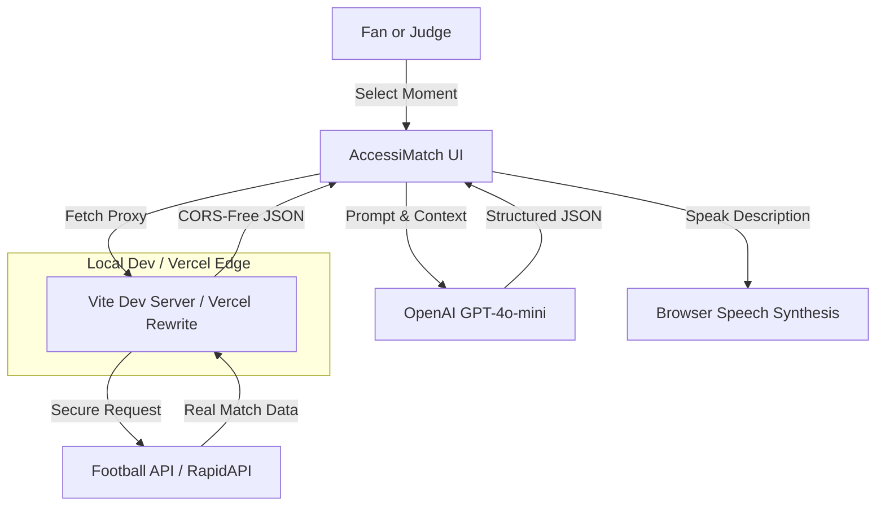

# AccessiMatch AI



AccessiMatch AI converts World Cup match moments into accessible, real-time explanations for blind, low-vision, neurodivergent, first-time, child-friendly, and tactical audiences.

The project is designed for the **IBM SkillsBuild AI Student Innovation Challenge**. It focuses on human-centered, explainable, and accessible AI instead of generic predictions, trivia, fantasy, or static analytics dashboards.

---

## 🌟 Key Features

### 📡 Real-Time Live Match Sync & API Feeds
- **Automatic Auto-Fetch on Mount**: The app automatically queries active tournament schedules on mount.
- **Multilevel Fallback Cascade**: 
  - Tries to fetch **today's live matches** first.
  - If today is off-season/empty, it queries past **FIFA World Cup (WC)** matches.
  - If the World Cup feed is empty, it queries the **Premier League (PL)** matches.
  - If all external API calls are down, it falls back to a high-fidelity offline mode.
- **Audience-Specific Explanations**: Adapt explanations dynamically using OpenAI's **GPT-4o-mini** models or local backup templates.
- **Dynamic Event Generator**: Injects dynamic Goal, Foul, Substitution, and Tactical pressure swing events into the timeline based on real-time match scores.

### 🛡️ CORS Bypass Proxy Gateway (Vite + Vercel)
To prevent browser-side CORS (Cross-Origin Resource Sharing) blockages during local development or production:
- **Local Dev Proxy (`vite.config.ts`)**: Routes `/api-football-live` and `/api-football-data` local endpoints through Node.js, appending RapidAPI and Football-Data credentials server-side.
- **Production Rewrites (`vercel.json`)**: Configures serverless path rewrites on Vercel so CORS-bypassing works in the cloud exactly as it does on localhost.
- **Prevents Credentials Leaks**: No API keys are visible to client-side network inspectors.

### 📱 Streamlined & Premium Mobile UI
- **Zero Settings Bloat**: Settings tab removed; core accessibility features (Language selector, High Contrast theme) are globally accessible directly from the header.
- **Clean Responsive Grids**: Grids (`.explorer-grid`, `.learn-grid`, `.saved-grid`) collapse to a single column on screens under `990px`.
- **Adaptive Header**: Under `768px`, the header topbar transitions to a clean vertical stack, centering branding and wrapping action elements seamlessly on all devices down to `320px`.

---

## 🧭 Demo Flow

1. Open the app.
2. Select the **Match Explorer** tab to see real matches syncing from the API (with a visual loader).
3. Select any match (e.g. *Germany vs Paraguay* or *France vs Sweden*).
4. Go to **Accessible Explain** tab, select a moment from the timeline, and choose an audience mode (e.g. **Blind Audio**, **Beginner**, or **Tactical**).
5. Click **Generate Explanation** to trigger the OpenAI GPT pipeline.
6. Click **Play Audio** to hear browser text-to-speech audio description.
7. Save the analysis to **My Library** to store explanations offline.

---

## 🛠️ Installation & Setup

1. Clone the repository:
   ```bash
   git clone git@github.com:NikhilRaikwar/AccessiMatch-AI.git
   cd AccessiMatch-AI
   ```
2. Install dependencies:
   ```bash
   npm install
   ```
3. Create a `.env` file in the project root:
   ```env
   VITE_OPENAI_API_KEY=your_openai_api_key_here
   VITE_FOOTBALL_DATA_API_KEY=your_football_data_org_token_here
   VITE_API_FOOTBALL_KEY=your_rapidapi_football_key_here
   ```
4. Run the local development server:
   ```bash
   npm run dev
   ```
5. Build the production package:
   ```bash
   npm run build
   ```

---

## 🏛️ Architecture



---

## 🤖 IBM Technology Fit

- **IBM Bob**: Used as the AI development assistant for planning, UI refactoring, CORS-bypass integration, and purging hardcoded secrets from git history.
- **IBM Granite-ready architecture**: Structured to support Granite generation through watsonx.ai prompts once active billing is available.
- **Docling-ready source pipeline**: Ready to ingest official FIFA rulebooks and technical reports to compile sources.
- **LangChain / LangFlow-ready routing**: Prompt selectors map moments to the chosen accessibility profile.

For detailed development sessions, refer to the [bob_sessions/](bob_sessions/) directory:
- [Session 1: Idea and Architecture Planning](bob_sessions/bob_task_july-01-2026_accessimatch-ai.md)
- [Session 2: API Integration and Responsive Refactoring](bob_sessions/bob_session_api_and_responsive_refactoring.md)
