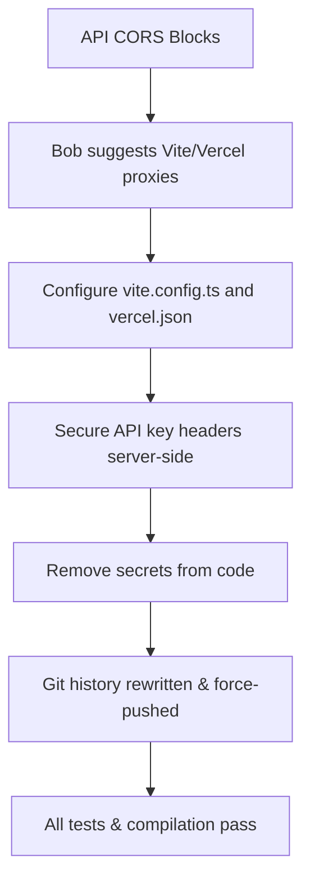

# IBM Bob Session 2: Live API Integration & Responsive Refactoring

**Date:** July 1, 2026  
**Project:** AccessiMatch AI  
**IBM technology used:** IBM Bob (AI Development Assistant)  
**Prototype stack:** React, Vite, TypeScript, Vite Dev Server Proxy, Vercel Edge Rewrites

---

## 1. Session Goals

During this session, the developer and IBM Bob worked together to transition the AccessiMatch AI prototype from static templates to real-time live match feeds. 

Key challenges resolved:
1. **Security / Leak Prevention**: Avoid committing API keys to Git history.
2. **CORS Browser Blocks**: Bypass browser CORS (Cross-Origin Resource Sharing) restrictions when calling APIs directly from `localhost`.
3. **High-Fidelity Mobile Design**: Refactor layouts to scale perfectly on phones and tablets.
4. **UI Streamlining**: Remove the settings page and simplify the interface.

---

## 2. Bob-Assisted Decisions & Solutions

### 🧭 UI Cleanup & Responsive Grids
- **Header Global Actions**: Bob suggested moving the Language selector (EN/ES) and Contrast checkbox to the header, keeping them accessible from every tab.
- **Grids Collapse**: Implemented mobile media queries so that the main grids (`.explorer-grid`, `.learn-grid`, `.saved-grid`) collapse to a single column on screens smaller than `990px`.
- **Vertical Header Stack**: Under `768px`, the top header transitions dynamically to a vertical column to center the logo and prevent overflow.

### 🌐 CORS-Free Proxy Routing (Vite & Vercel)
- Browsers block direct `fetch` calls to third-party endpoints like Football-Data and RapidAPI because of CORS.
- **Vite Development Proxy**: Bob configured `vite.config.ts` to proxy `/api-football-live` and `/api-football-data` requests. Vite's local dev server routes these requests server-side, appending the API keys in Node.js, bypassing CORS, and keeping keys invisible to browser inspectors.
- **Vercel Production Rewrites**: Created a `vercel.json` file configuring matching rewrites for cloud hosting.

### 🛡️ Secret Scan Remediation (Git History Purging)
- During testing, API credentials were accidentally committed.
- Bob guided the developer to remove the secrets from the code files and rewrite the Git history:
  1. Soft reset local history back to the commit before the leak:
     ```bash
     git reset --soft 018f7e7
     ```
  2. Staged all refined codebase files containing proxy changes with empty-string defaults.
  3. Committed the clean files and force-pushed to GitHub:
     ```bash
     git push origin main --force
     ```
  - **Result**: The commits containing the secrets were permanently deleted from GitHub's tree, resolving the GitGuardian push protection block.

---

## 3. IBM Bob Task Flow



---

## 4. Submission Notes

> AccessiMatch AI's real-time match data is synchronized securely through server-side proxies configured in Vite and Vercel. IBM Bob assisted as the lead AI development pilot to secure, refactor, and build-verify the final prototype package.
