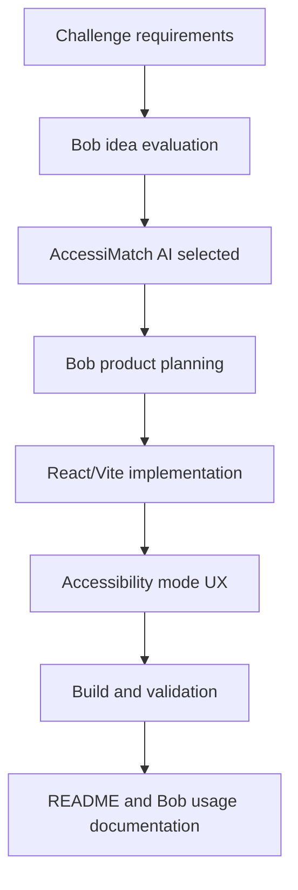
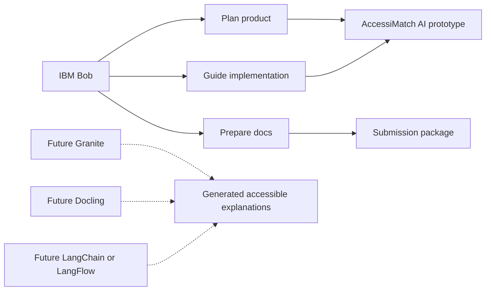

# IBM Bob Session: AccessiMatch AI

**Date:** July 1, 2026  
**Project:** AccessiMatch AI  
**Challenge:** IBM SkillsBuild AI Student Innovation Challenge - FIFA World Cup inspired AI solution  
**IBM technology used:** IBM Bob  
**Prototype stack:** React, Vite, TypeScript, browser speech synthesis  

## User Task

Build a winning but feasible project for the FIFA World Cup AI challenge. The project should be easier to implement than a live sports-data platform, but still strong enough to compete on innovation, challenge fit, technical execution, and feasibility.

Final selected idea:

> AccessiMatch AI makes match moments understandable for blind, low-vision, neurodivergent, first-time, child-friendly, and tactical audiences.

## Bob-Assisted Planning

IBM Bob helped evaluate the challenge requirements and steer the project toward a human-centered idea instead of a common predictor, VAR explainer, or static analytics dashboard.

Key planning decisions:

- Focus on accessibility because it is emotionally clear, globally relevant, and less crowded.
- Build a working prototype around match moments, not a generic chatbot.
- Make the demo usable without paid APIs so judges can run it immediately.
- Use browser text-to-speech for the MVP audio-description experience.
- Document Granite, Docling, and LangChain as production integration paths while using IBM Bob as the implemented IBM-supported technology.

## Product Requirements Generated With Bob

The MVP should let a judge:

1. Select a World Cup-style match moment.
2. Choose an audience mode.
3. Generate a structured explanation.
4. Understand:
   - what happened
   - why it matters
   - what to watch next
5. Play the explanation as audio.
6. Adjust readability, text size, contrast, motion, captions, and language controls.

## Implementation Work Supported By Bob

Bob was used as the development assistant for:

- selecting the React + Vite implementation approach
- replacing the previous HeatTactix concept with AccessiMatch AI
- designing the dashboard layout
- creating audience-specific explanation modes
- implementing interactive state for selected moments and explanation modes
- adding browser speech synthesis for the audio-description feature
- updating package metadata, favicon, and page title
- preparing the README and hackathon documentation
- validating the project with a production build

## IBM Bob Development Flow



## Current Working Prototype

Implemented features:

- Match moment timeline
- Five explanation modes:
  - Blind audio
  - Beginner
  - Low cognitive load
  - Child-friendly
  - Tactical
- Structured explanation cards:
  - What happened
  - Why it matters
  - What to watch next
- Browser text-to-speech
- Reading level control
- Text size control
- Contrast and motion controls
- Source chips
- Responsive dashboard-style UI

## IBM Technology Positioning



The submitted prototype uses IBM Bob directly as the IBM-supported technology in the build process. Granite integration is intentionally documented as optional because the watsonx.ai runtime was inactive during development and required billing activation.

## Challenge Criteria Mapping

### Technical Execution

The project has a functioning React/Vite prototype, multiple explanation modes, speech synthesis, interaction state, responsive UI structure, and build verification.

### Innovation

Most soccer AI projects focus on predictions, VAR calls, tactical dashboards, or player analytics. AccessiMatch AI focuses on who gets excluded from understanding the match and adapts the same event for different cognitive and sensory needs.

### Challenge Fit

The challenge asks teams to help people understand soccer. AccessiMatch AI directly addresses understanding before, during, and after match moments, especially for fans who need accessible explanations.

### Implementation And Feasibility

The MVP works without paid sports data or paid AI APIs. It can later be expanded with Granite, Docling, LangChain, live match feeds, multilingual speech, and user testing.

## Demo Script

1. Open the app.
2. Select the 61' momentum swing event.
3. Generate a Blind audio explanation.
4. Play the audio.
5. Switch to Beginner mode to show simplified language.
6. Switch to Low cognitive load mode to show shorter explanations.
7. Show accessibility controls.
8. Explain that IBM Bob helped plan, implement, debug, and document the project.

## Validation

Build command:

```bash
npm run build
```

Expected result:

```text
TypeScript compilation succeeds.
Vite production build completes.
```

## Notes For Submission

Do not claim that live Granite is currently generating the prototype output unless an active watsonx.ai runtime is connected. The honest submission wording is:

> AccessiMatch AI was built with IBM Bob as the AI development assistant. The app is Granite-ready and documents how Granite, Docling, and LangChain would power production explanations when watsonx.ai access is available.

