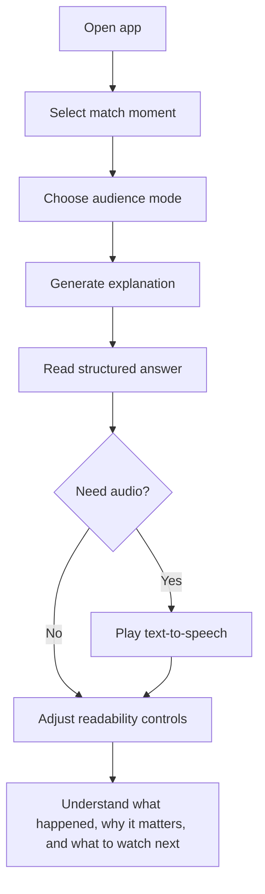
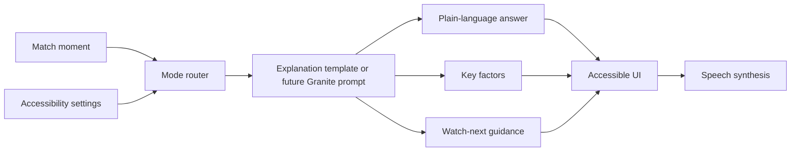
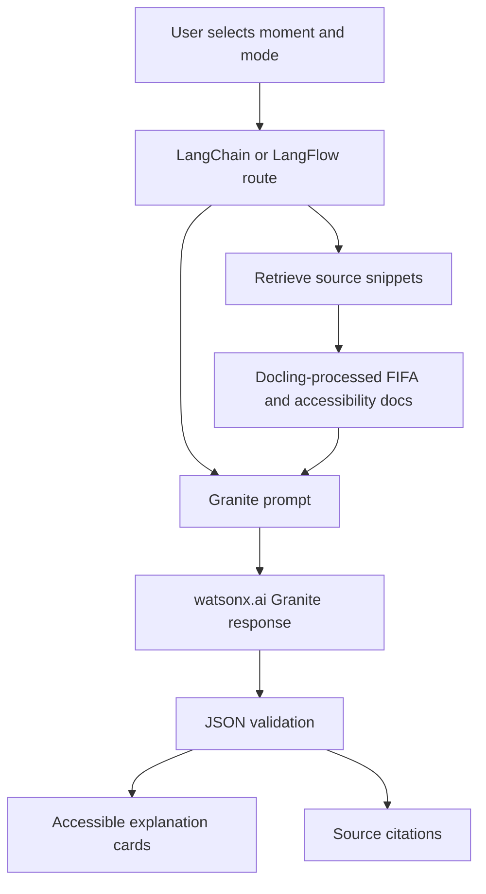
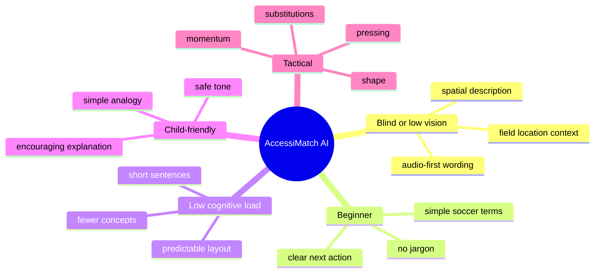

# AccessiMatch AI Architecture

This document gives the project diagrams for README, submission review, and video narration.

## User Flow

## Explanation Pipeline

## Future IBM AI Integration

## Accessibility Modes

