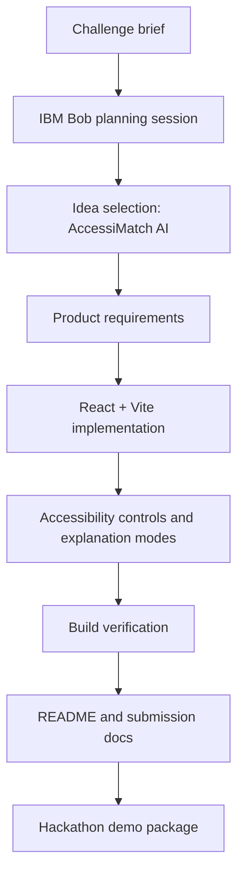
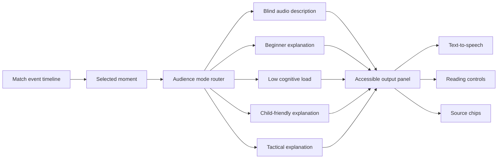
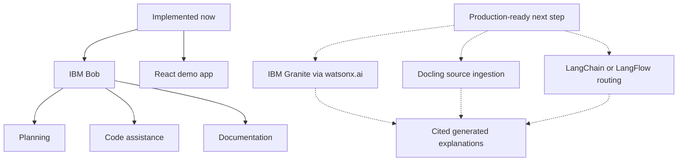

# IBM Bob Usage

This project uses IBM Bob as the IBM-supported AI development assistant for AccessiMatch AI. Bob helped convert the challenge requirements into a focused product, organize the accessibility modes, guide the React/Vite implementation, and prepare the documentation needed for judging.

## Why IBM Bob Fits This Project

AccessiMatch AI is not only an app idea; it is also a demonstration of how an AI development partner can help a student team move from challenge brief to working prototype quickly. IBM Bob was used for:

- interpreting the hackathon judging criteria
- narrowing the idea to a human-centered accessibility product
- planning the UI and demo flow
- structuring the explanation modes
- implementing the React prototype
- debugging build issues
- writing the README and submission positioning
- documenting future Granite, Docling, and LangChain integration paths

## Bob-Assisted Development Workflow

## Product Architecture

## IBM Technology Story For Judges

The current working prototype does not require a paid watsonx runtime. Granite integration is documented as an upgrade path because the trial runtime was unavailable during implementation. This keeps the submission honest while still showing a clear IBM AI architecture.

## How Bob Improved The Build

Bob helped keep the project aligned with the challenge by pushing the product away from a generic chatbot and toward a focused fan-experience tool. The resulting app has:

- a match-moment selector instead of an empty chat box
- five audience modes with different explanation styles
- an audio-description path for blind and low-vision fans
- cognitive-load controls for neurodivergent users
- source chips to avoid opaque AI output
- a README that clearly explains problem, solution, IBM usage, and demo flow

## Submission Positioning

For the 3-minute video, explain IBM Bob usage like this:

> IBM Bob helped us turn the challenge brief into a working accessibility-focused soccer explainer. We used Bob to plan the product, structure the React app, design audience-specific explanation modes, debug the prototype, and prepare the documentation. AccessiMatch AI then uses that Bob-assisted build process to make World Cup moments understandable for fans who are often left out of traditional match coverage.

## Suggested Demo Script

1. Open AccessiMatch AI.
2. Select the 61' momentum swing event.
3. Switch between Blind audio, Beginner, Low cognitive load, Child-friendly, and Tactical modes.
4. Click Generate explanation.
5. Play the audio description.
6. Show reading level, text size, high contrast, and caption controls.
7. End by showing this IBM Bob usage document and the Bob session log.

